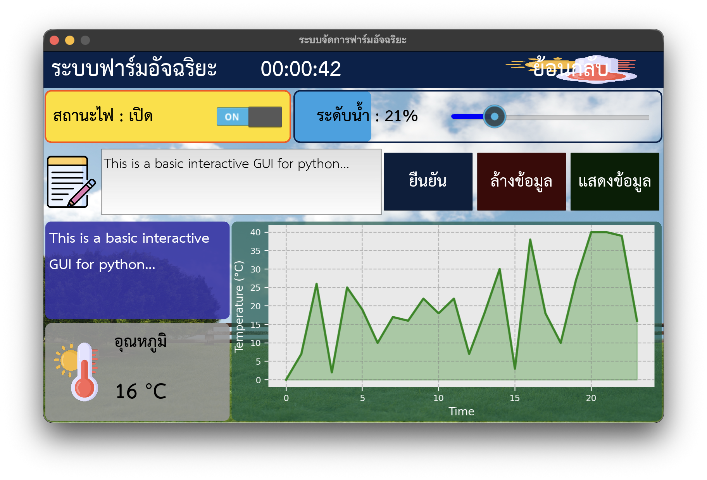

# SmartFarm Kivy GUI Example

Training application for Smart Farm program – **College of Computing, Khon Kaen University**. Built with **Kivy**, featuring Thai localization, real-time charts, and interactive controls.

<div align="center">

</div>

## Overview

Smart farm control panel demo with:
* Multi-screen navigation & Thai fonts (TH Sarabun New)
* Real-time temperature chart (Matplotlib embedded)
* Light switch & water level slider with visual feedback
* Popup dialog for system state summary

## Quick Start

```bash
# Clone the repository
git clone https://github.com/geeksloth/smartfarm-kivy-gui-example.git
cd smartfarm-kivy-gui-example

# Create virtual environment with Python 3.13
python3.13 -m venv smartfarm-gui

# Activate virtual environment
source smartfarm-gui/bin/activate

# Upgrade pip and install setuptools
pip install --upgrade pip
pip install setuptools==68.0.0

# Install required packages
pip install kivy kivy_garden.matplotlib matplotlib numpy

# Run the application
python gui-3/demo2.py
```

## Dependencies

**Python 3.10+** recommended. Key packages:
- `kivy` – GUI framework
- `kivy_garden.matplotlib` – Matplotlib embedding
- `matplotlib`, `numpy` – Chart rendering
- Font files: `THSarabunNew.ttf` (place in `gui-3/THSarabunNew/`)

## Key Files

- `gui-3/demo2.py` – Main application
- `gui-3/Farm2.kv` – UI layout
- `gui-3/THSarabunNew/` – Thai fonts

## Troubleshooting

| Issue | Fix |
|-------|-----|
| Thai font missing | Verify `.ttf` files in `gui-3/THSarabunNew/` |
| Chart not showing | Install `kivy_garden.matplotlib` |
| High CPU usage | Increase update interval to `0.1s` in `demo2.py` |

## Extending

- Replace random data with sensor input (serial/MQTT)
- Add logging (SQLite/CSV)
- Integrate actuators (GPIO/microcontroller)

## Acknowledgements

**Author/Trainer**: Mr. Patchara Paungsiri  
College of Computing, Khon Kaen University – SmartFarm training program. Educational use only.
